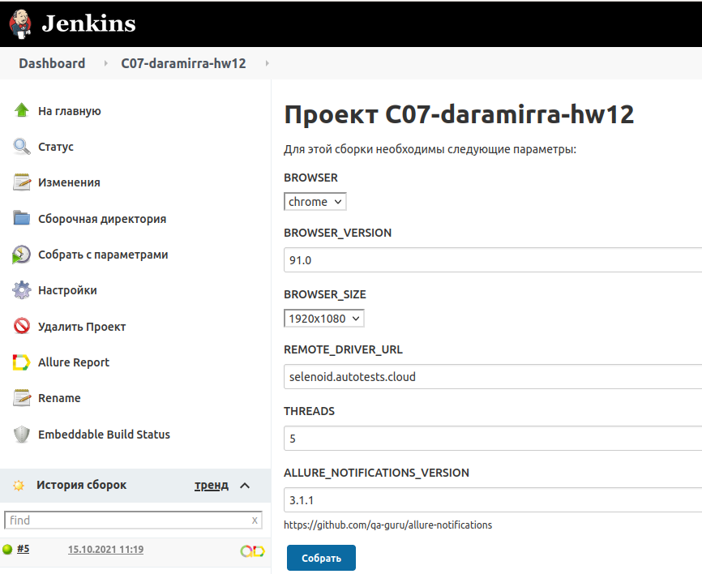
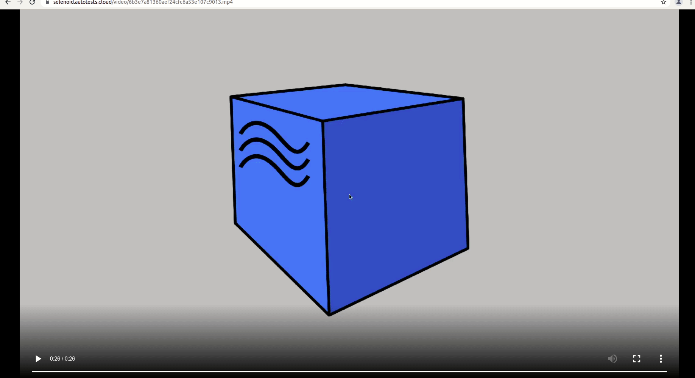

<p align="right">
   
<br>
</p>

# Проект по автоматизации тестирования форм

### &nbsp;&nbsp;&nbsp;&nbsp;&nbsp;&nbsp;&nbsp;&nbsp;&nbsp;:heavy_check_mark: [входа в личный кабинет](https://mmc.mos.ru/client-office/security/auth-rvg/login?2&service=http://mmc.mos.ru/client-office/auth/signin-cas)

### &nbsp;&nbsp;&nbsp;&nbsp;&nbsp;&nbsp;&nbsp;&nbsp;&nbsp;:heavy_check_mark: [регистрации личного кабинета](https://mmc.mos.ru/client-office/security/lk/register?service=http://mmc.mos.ru/client-office/auth/signin-cas)

### &nbsp;&nbsp;&nbsp;&nbsp;&nbsp;&nbsp;&nbsp;&nbsp;&nbsp;:heavy_check_mark: [восстановления пароля личного кабинета](https://mmc.mos.ru/client-office/security/auth-rvg/recovery-password?1&service=http://mmc.mos.ru/client-office/auth/signin-cas)

 > *Данные формы являются частью разработки **[Системы обеспечения информационной безопасности "ВИЗОР"](http://visor.frte.ru/solutions/)**, реализованной компанией **[ФРЕШТЕХ](http://visor.frte.ru/solutions/)**, сотрудником которой я являюсь на данный момент.*

## Технологии и инструменты
<p  align="center"
   
  <code></code>
  <code></code>
  <code></code>
  <code></code>
  <code></code>
  <code></code>
  <code></code>
  <code></code>
  <code></code>
  <code></code>
  <code></code>
  <code></code>
</p>

>*В данном проекте автотесты написаны на  <code><strong>*Java*</strong></code> с использованием фреймворка <code><strong>*Selenide*</strong></code>.*
>
>*Для сборки проекта используется <code><strong>*Gradle*</strong></code>.*
> 
>*<code><strong>*JUnit 5*</strong></code> используется как фреймворк для модульного тестирования.*
>  
>*<code><strong>*Allure Report, Allure TestOps, Jira, Telegram Bot*</strong></code> используются для визуализации результатов тестирования.*
>   
>*Запуск тестов выполняется из <code><strong>*Jenkins*</strong></code>.*
>    
>*<code><strong>*Selenoid*</strong></code> используется для запуска браузеров в контейнерах  <code><strong>*Docker*</strong></code>.*

## Реализованы проверки

### UI
&nbsp;&nbsp;&nbsp;&nbsp;&nbsp;&nbsp;:green_circle:&nbsp;&nbsp;Проверка заголовка страницы входа в личный кабинет иностранного гражданина

&nbsp;&nbsp;&nbsp;&nbsp;&nbsp;&nbsp;:green_circle:&nbsp;&nbsp;Лог консоли браузера на странице входа в личный кабинет не содержит ошибок

&nbsp;&nbsp;&nbsp;&nbsp;&nbsp;&nbsp;:green_circle:&nbsp;&nbsp; Переход на вкладку 'Почта' на странице входа в личный кабинет

&nbsp;&nbsp;&nbsp;&nbsp;&nbsp;&nbsp;:green_circle:&nbsp;&nbsp; Попытка входа в личный кабинет с невалидным значением телефона

&nbsp;&nbsp;&nbsp;&nbsp;&nbsp;&nbsp;:green_circle:&nbsp;&nbsp; Попытка входа в личный кабинет без указания пароля

&nbsp;&nbsp;&nbsp;&nbsp;&nbsp;&nbsp;:green_circle:&nbsp;&nbsp; Переход на страницу 'Регистрация пользователя'

## Запуск тестов из терминала

 > *Запуск тестов с заполненным remote.properties:*
```bash
gradle clean test
```
 > *Запуск тестов без заполненного remote.properties:*
```bash
gradle clean -DremoteDriverUrl=https://%s:%s@selenoid.autotests.cloud/wd/hub/ -DvideoStorage=https://selenoid.autotests.cloud/video/ -Dthreads=1 test
```
 > *Запуск тестов в несколько потоков*
```bash
gradle clean -Dthreads=5
```
 >*Сформировать allure отчет:*
```bash
allure serve build/allure-results
```

##  Запуск тестов в [Jenkins](https://jenkins.autotests.cloud/job/C07-daramirra-hw12/)
### Параметры сборки

    BROWSER (default chrome)
    BROWSER_VERSION (default 91.0)
    BROWSER_SIZE (default 1920x1080)
    REMOTE_DRIVER_URL (url address from selenoid or grid. default selenoid.autotests.cloud)
    TREADS (default 5)
    ALLURE_NOTIFICATIONS_VERSION (default 3.1.1)
<p align="center">
  
</p>

##  Отчет о результах тестирования в [Allure Report](https://jenkins.autotests.cloud/job/C07-daramirra-hw12/5/allure/)
### Общая информация
<p align="center">
  
</p>
### Список тестов c описанием шагов и визуализацией результатов
<p align="center">
  
</p>


##  Пример запуска теста в Selenoid 
<p align="center">
  
</p>


<br><br>
